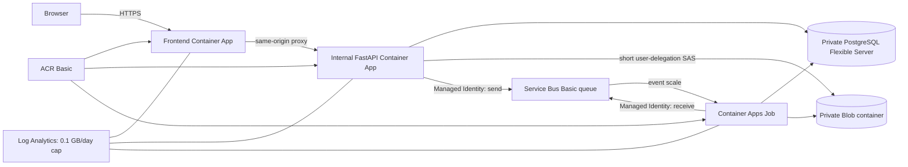

# Azure staging architecture

Status: provider registration and remote-state bootstrap complete; the
**FootballAI staging foundation is not deployed**.

## Verified subscription discovery

On 2026-08-16, Azure CLI showed the enabled **Azure for Students** subscription
under the ESPRIT tenant. The pre-bootstrap resource-group and generic-resource
inventories were empty. P3.1 registered only the namespaces required by the
reviewed 27-resource foundation plan: `Microsoft.App`,
`Microsoft.ContainerRegistry`, `Microsoft.Storage`, `Microsoft.ServiceBus`,
`Microsoft.DBforPostgreSQL`, `Microsoft.OperationalInsights`,
`Microsoft.ManagedIdentity`, and `Microsoft.Network`.
`Microsoft.Authorization` and `Microsoft.Resources` were already registered.

P3.1 then created an isolated `rg-footballai-tfstate-stg` resource group, the
Standard LRS `footballaitfstg1a06f8` StorageV2 account, a private `tfstate`
container, and a container-scoped `Storage Blob Data Contributor` assignment for
the operator. Shared Key and anonymous access are disabled. Staging state uses
the `footballai/staging.tfstate` blob with Azure CLI / Microsoft Entra
authentication and native Blob lease locking.

Provider metadata showed France Central support for Container Apps environments,
apps and jobs, PostgreSQL Flexible Server, Service Bus, ACR, Storage and the other
foundation services. France Central PostgreSQL discovery exposed the Burstable
`Standard_B1ms` family and a 32 GiB minimum disk. West Europe and North Europe
remain reasonable fallback regions. VM-usage discovery returned no allocations;
GPU availability was not demonstrated and is not a dependency.

Azure for Students has finite credit and can disable services when credit is
exhausted. Exact credit balance and service-specific Container Apps quotas were
not exposed by the read-only CLI calls. Container Apps environment usage can be
checked only after an environment exists. Quota availability therefore remains
a foundation-apply gate.

## Selected topology

All resources use France Central and one resource group. The Container Apps
environment uses a delegated VNet subnet. PostgreSQL uses a separate delegated
subnet and private DNS, with public access disabled. The public frontend is the
only internet-facing workload; the API uses internal ingress. Blob, Service Bus,
and ACR retain public service endpoints to avoid private-endpoint and NAT fixed
costs, but anonymous/shared-key/local authentication is disabled and access is
through narrowly scoped identities or one-object, short-lived upload SAS tokens.

## Cost-conscious choices

- PostgreSQL 16 uses the smallest verified Burstable SKU (`B_Standard_B1ms`),
  32 GiB storage, seven-day backup retention, no HA and no geo-redundant backup.
- ACR and Service Bus use Basic. Service Bus duplicate detection is unavailable
  at this tier; FootballAI's immutable attempts and idempotent claim path provide
  the application-level safety boundary.
- Frontend and API scale from zero to one replica. The CPU worker is an
  event-triggered Container Apps Job with zero minimum executions, one maximum
  execution and a two-hour bound. Staging runs `demo_fast` or bounded clips; no
  GPU or full-match cloud benchmark is assumed.
- Log Analytics keeps 30-day retention with a 0.1 GB/day ingestion cap.
- Key Vault, Application Insights, dashboards, private endpoints, NAT Gateway,
  zone redundancy and GPU compute are deferred. Key Vault alone would not remove
  a generated database password from Terraform state; Entra-authenticated
  PostgreSQL is the preferred later passwordless improvement.

PostgreSQL is the dominant always-on cost risk. ACR and Service Bus also have
idle charges, while scaled-to-zero Container Apps are primarily usage driven.
Prices and remaining student credit must be checked in Azure Cost Management
immediately before apply.

## Identity and deployment boundary

Three user-assigned managed identities enforce least privilege:

- frontend: `AcrPull` only;
- API: `AcrPull`, container-scoped Storage Blob Data Contributor,
  account-scoped Storage Blob Delegator, and queue-scoped Azure Service Bus Data
  Sender;
- worker: `AcrPull`, container-scoped Storage Blob Data Contributor, and
  queue-scoped Azure Service Bus Data Receiver.

Local Terraform uses the authenticated Azure CLI. Future CI should use GitHub
OIDC federation, never a client secret. Workload resources are represented in
Terraform but `deploy_workloads` defaults to `false`; P4 must first publish
images tagged with an immutable 40-character Git SHA.

No image push, Container App or Job deployment, custom domain, GPU resource,
cloud analysis, or 27-resource staging foundation apply was performed in P3.1.
