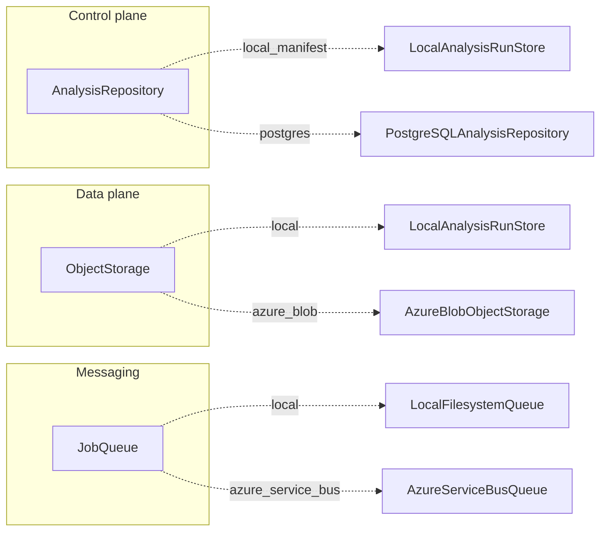
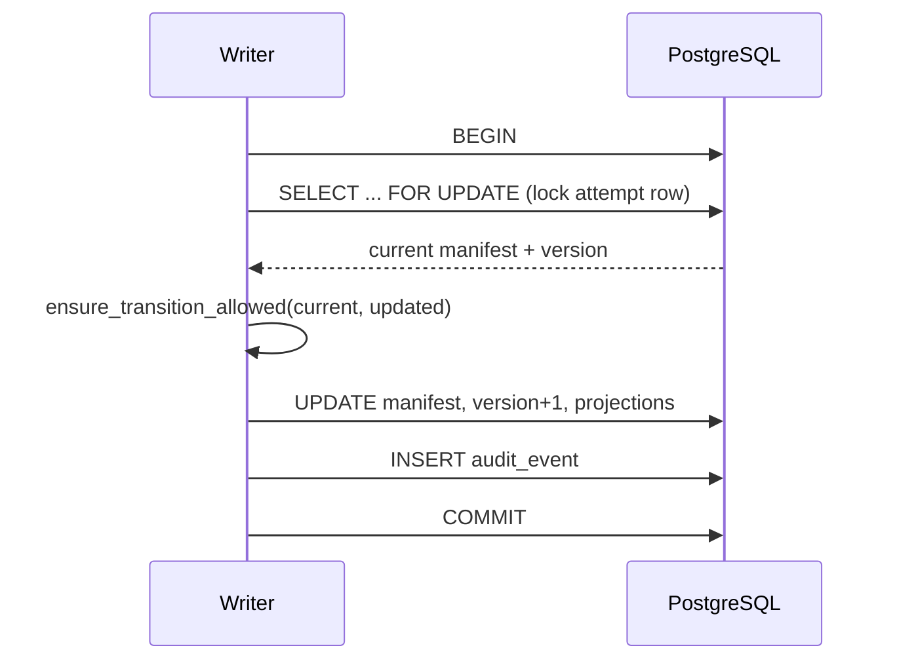
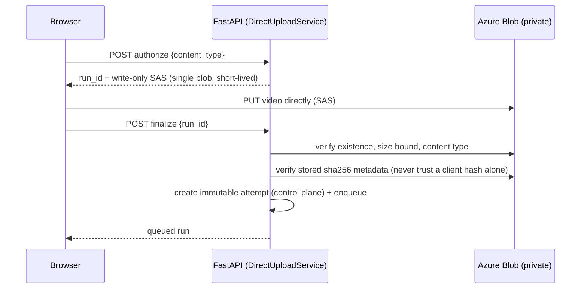
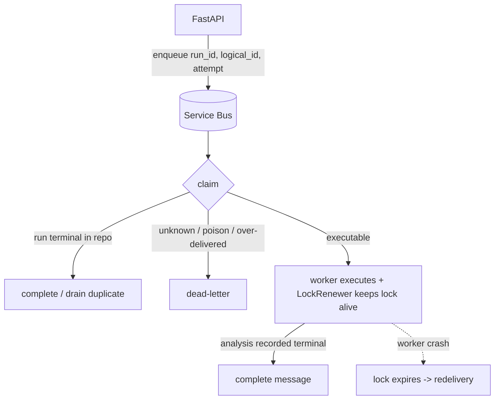

# P2 — Production cloud adapters

Status legend used throughout this document:

- **Implemented** — code exists and passes deterministic unit/contract tests.
- **Emulator-validated** — additionally exercised against a real local emulator
  (PostgreSQL container, Azurite Blob).
- **Real-Azure pending** — not yet run against a real Azure resource. No Azure
  resources were created and no Azure credit was consumed in P2.

| Adapter | Port | State |
|---|---|---|
| `PostgreSQLAnalysisRepository` | `AnalysisRepository` (control plane) | **Emulator-validated** (PostgreSQL 16 container) |
| `AzureBlobObjectStorage` | `ObjectStorage` + `UploadAuthorizer` (data plane) | **Emulator-validated** (Azurite) · real-Azure pending |
| `AzureServiceBusQueue` | `JobQueue` | **Implemented** (fake-broker contract) · real-Azure pending |

P2 keeps the `footballai.analysis-run/v1` contract untouched. Cloud adapters
round-trip the immutable `AnalysisRun` manifest through `to_dict()/from_dict()`,
so terminal immutability, the retry chain, attempt-specific provenance, and
artifact integrity metadata are preserved by construction.

## Planes

The local `LocalAnalysisRunStore` fuses two responsibilities that the cloud
architecture separates:



- **Control plane (PostgreSQL):** structured, transactional lifecycle — logical
  analyses, immutable attempts, stage state, artifact *metadata*, audit events.
  No video bytes, no large artifacts.
- **Data plane (Azure Blob):** uploaded videos and published artifact bytes,
  addressed by opaque, run-scoped object references.
- **Messaging (Azure Service Bus):** at-least-once job delivery; the control
  plane remains the authority on whether a job is still executable.

## PostgreSQL control plane

**Decision (dependencies):** SQLAlchemy Core + Alembic + psycopg 3, *not* an ORM.
The domain `AnalysisRun` is already a rich immutable dataclass with its own
validation and serialization; an ORM would duplicate and fight it. Core gives
explicit SQL and explicit transactions, and the manifest is stored verbatim as
authoritative JSONB with scalar/relational projections for querying.

Schema (`0001_initial`):

- `logical_analyses` — one row per logical analysis (the retry-chain grouping).
- `analysis_attempts` — one immutable attempt: `run_id` PK, `logical_analysis_id`,
  `attempt_number`, `previous_attempt_run_id`, `status`, `data_origin`,
  `pipeline_version`, `contract_version`, authoritative `manifest` JSONB, a
  monotonic `version` (optimistic token), and `created/started/completed_at`.
  `UNIQUE(logical_analysis_id, attempt_number)`.
- `stage_executions` — per-attempt stage projection.
- `artifact_metadata` — per-attempt artifact **metadata only** (id, category,
  path, sha256, size, schema version).
- `audit_events` — append-only lifecycle log.

**Transactions & concurrency.** Every read-modify-write locks the attempt row
with `SELECT … FOR UPDATE`, validates the transition against the freshly-read
current state, then writes — so two racing writers (e.g. an API cancel and a
worker completion) are serialized and the loser correctly observes a terminal
state and is rejected. A monotonic `version` column additionally supports
optimistic rejection when a caller passes `expected_version`.



The transition/immutability rules live once in `storage/lifecycle.py` and are
shared by the local and PostgreSQL adapters, so they cannot diverge.

**Migrations are explicit** (never a startup side effect):

```bash
make p2-db-up        # PostgreSQL + Azurite dev stack (compose.p2.yaml)
make p2-db-migrate   # alembic upgrade head
make p2-test         # migrate, then run v2 tests against the emulators
make p2-db-down      # tear down (disposable data)
```

`PostgreSQLAnalysisRepository.verify_schema()` fails fast if the applied Alembic
revision does not match the expected `SCHEMA_REVISION`.

## Azure Blob data plane & direct upload

Azure SDK usage is confined to `storage/object_storage/azure_blob.py` and its
credential strategy; callers only exchange opaque object references and
provider-neutral values. The container is **private**; browsers never receive a
storage account key and cannot address arbitrary blobs.

Direct upload replaces "browser streams a multi-GiB video through FastAPI":



Authorization is bounded by object key/prefix (`runs/<run_id>/input/…`), upload
size, expiry, and **create+write only** permission. The mounted endpoints are
`POST /api/v1/uploads/authorize` and `POST /api/v1/uploads/finalize`. In
development/emulator the
SAS is signed with the account key (Azurite); in production the credential
strategy uses `DefaultAzureCredential` + a short-lived **user-delegation SAS**,
so no account key exists in the process. `finalize` is idempotent: a duplicate
finalize returns the existing attempt instead of creating a second one.

Finalization verifies size, media type and SHA-256 metadata, then uses a bounded
server-side Blob copy into the immutable attempt key. The destination is
write-once and the completed copy is re-verified for size and digest. The legacy
multipart local upload endpoint is unchanged and keeps working.

## Azure Service Bus queue

Service Bus is at-least-once infrastructure, so the execution path is
idempotent and the **control plane is the final authority** on executability.



- **Enqueue** carries stable identifiers (`run_id`, `logical_analysis_id`,
  `attempt_number`) with the job id as the message id.
- **Claim** consults the repository: an already-terminal run drains the
  duplicate (complete); an unknown run, an unparseable body, or a message past
  `max_delivery` is dead-lettered; otherwise the job is handed back with a
  background `LockRenewer` keeping the peek-lock alive.
- **Complete/fail** both settle by completing the message: a recorded analysis
  failure is a terminal, immutable outcome — retrying is a *new* run via the
  retry flow, not a redelivery. Infrastructure failures never call `fail()`; the
  lock simply expires and Service Bus redelivers.
- **Cancellation** is control-plane driven; the queue message is drained on a
  later claim once the run is terminal.

**Lock renewal.** A FootballAI analysis can outlast one lock. `LockRenewer` runs
on a background thread, renews on a bounded interval, stops on completion,
failure, or shutdown, and is capped by a maximum lifetime so a leaked renewer
can never hold a lock forever. It is provider-neutral and unit-tested with a
fake (no 95-minute inference test).

**Duplicate delivery** cannot create a second attempt: `create` is keyed by
`run_id` (PK), and `finalize`/claim treat an existing terminal run idempotently.

## Composition root & configuration

`footballai_v2/composition.py` is the only place that turns backend names into
adapters. It fails fast and never silently falls back.

| Variable | Values | Required when |
|---|---|---|
| `FOOTBALLAI_DATABASE_BACKEND` | `local_manifest` \| `postgres` | — |
| `FOOTBALLAI_OBJECT_STORAGE_BACKEND` | `local` \| `azure_blob` | — |
| `FOOTBALLAI_QUEUE_BACKEND` | `local` \| `azure_service_bus` | — |
| `FOOTBALLAI_DATABASE_URL` | connection string (secret) | `database_backend=postgres` |
| `FOOTBALLAI_BLOB_CONNECTION_STRING` | Azurite/dev connection string (secret) | `azure_blob` (dev) |
| `FOOTBALLAI_BLOB_ACCOUNT_URL` | `https://<acct>.blob.core.windows.net` | `azure_blob` (managed identity) |
| `FOOTBALLAI_BLOB_CONTAINER` | container name (default `footballai-runs`) | `azure_blob` |
| `FOOTBALLAI_SERVICEBUS_CONNECTION_STRING` | connection string (secret) | `azure_service_bus` in development |
| `FOOTBALLAI_SERVICEBUS_NAMESPACE` | fully qualified namespace | `azure_service_bus` with managed identity |
| `FOOTBALLAI_SERVICEBUS_QUEUE` | queue name | `azure_service_bus` |

Selecting a cloud backend without its configuration raises at startup with a
clear message. Secrets are only ever read from the environment at runtime; none
are committed.

The migration history is now frozen: `0001_initial` creates the exact original
tables and `0002_cancellation` adds/removes the cancellation column explicitly.
Tests exercise empty-to-head and `0001`-to-`0002` upgrades and their documented
downgrades against PostgreSQL.

## Readiness

`/health` stays simple process liveness. `runtime_readiness.CapabilityProbe`
provides bounded, TTL-cached capability checks (`postgres_capability` verifies
connectivity + migration revision; `blob_capability` verifies the private
container is reachable) so readiness never turns into an expensive per-request
operation and a transient cloud outage never restarts a healthy process.

## Test strategy

- **Fast/deterministic** (no emulator): domain, contract suites against the
  in-memory / local reference adapters, the Service Bus adapter against a
  faithful fake broker, the lock renewer, the direct-upload service, and
  composition validation.
- **Emulator-validated** (opt-in via env): `PostgreSQLAnalysisRepository`
  against a PostgreSQL container; `AzureBlobObjectStorage` against Azurite,
  including a real SAS `PUT` upload followed by checksum-verified finalize.
- **Split-plane end-to-end** (`tests/test_split_plane_e2e.py`, `make
  p2-split-test`): the real coordinator + worker + executor + API read path
  against PostgreSQL + Azurite + the local queue -- create/execute/succeed,
  retry chain, queued and running cancellation, deterministic failure, and
  duplicate-delivery idempotency.

Contract suites (`tests/contracts/`) run the same behavioural tests across
adapters:

```
AnalysisRepository  →  LocalAnalysisRunStore   +  PostgreSQLAnalysisRepository
ObjectStorage       →  InMemoryObjectStorage   +  AzureBlobObjectStorage (Azurite)
JobQueue            →  LocalFilesystemQueue     +  AzureServiceBusQueue (fake broker)
```

## Split control-plane / data-plane execution (P2.5)

The coordinator, worker, executor, and API read path now depend only on the
three ports -- `AnalysisRepository`, `ObjectStorage`, `JobQueue` -- and never on
the fused `LocalAnalysisRunStore`. The same real execution code runs in three
compositions, chosen at startup by the composition root:

```
Local        repository=LocalAnalysisRunStore  storage=LocalAnalysisRunStore  queue=LocalFilesystemQueue
Split local  repository=PostgreSQLAnalysisRepo  storage=AzureBlob (Azurite)    queue=LocalFilesystemQueue
Full Azure   repository=PostgreSQLAnalysisRepo  storage=AzureBlob              queue=AzureServiceBusQueue   (real-Azure pending)
```

Key properties, exercised by `tests/test_split_plane_e2e.py` against PostgreSQL +
Azurite + the local queue (`make p2-split-test`):

- **Input materialization** goes through `ObjectStorage.materialize_input`, which
  downloads to a bounded worker-local workspace and removes it after the pipeline
  returns (success, failure, or cancellation). The API never shares a filesystem
  with the worker.
- **Artifacts** are published through `ObjectStorage.write_artifact`; only their
  metadata (id, category, path, media type, size, sha256, schema version) is
  written to PostgreSQL. A terminal `succeeded`/`partial` state is gated on a
  provider-neutral integrity re-read (`artifact_reference_integrity`).
- **Cancellation** is authoritative control-plane state on the repository
  (`request_cancellation` / `cancellation_requested`; a `cancel_requested` column
  in PostgreSQL, added by migration `0002_cancellation`), never a filesystem
  marker. The worker observes it at safe checkpoints.
- **Idempotency**: the worker asks the repository -- not the queue -- whether a
  run should execute, so an at-least-once redelivery of a terminal job is a no-op
  and never creates a second attempt or duplicate artifacts.
- **Retry** preserves the attempt chain across planes (new `run_id`, same
  `logical_analysis_id`, `attempt_number + 1`, `previous_attempt_run_id`), with
  the source reused via `ObjectStorage.copy_input`.
- **Readiness** reflects the configured planes: split mode probes PostgreSQL
  (connectivity + schema revision) and the Blob container; local mode probes
  writable directories.

The synchronous multipart ingestion path remains for local/dev compatibility;
the direct-to-object `DirectUploadService` remains the preferred cloud ingestion
route. Both create the immutable attempt through the repository and enqueue one
job through the queue.

## Known limitations / what needs real Azure

- **Azure Service Bus** is validated only against a fake broker. Behaviour
  against a real namespace (lock durations, DLQ, duplicate detection settings)
  is **real-Azure pending**. The worker's idempotency logic is provider-neutral
  and covered by the split-plane suite, but real redelivery semantics are not.
- **Azure Blob** is validated against Azurite (including the new
  `put_input_file`, `copy_input`, `has_input`, and `artifact_reference_integrity`
  paths). User-delegation SAS via Managed Identity is implemented but only
  exercisable against a real account (**real-Azure pending**).
- **PostgreSQL** is validated against a container. Managed identity / Azure
  Database for PostgreSQL connectivity is **real-Azure pending**.

## What remains for P3

Real Azure provisioning (Terraform), an Azure staging environment, wiring the
cloud adapters into a deployed API/worker, and validating each adapter against
real Azure resources. No Azure resources are created until then.
