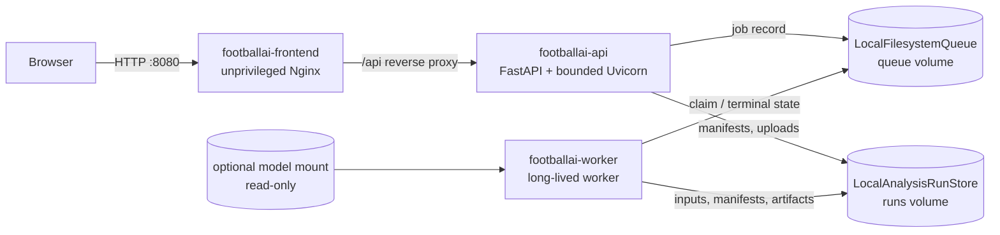
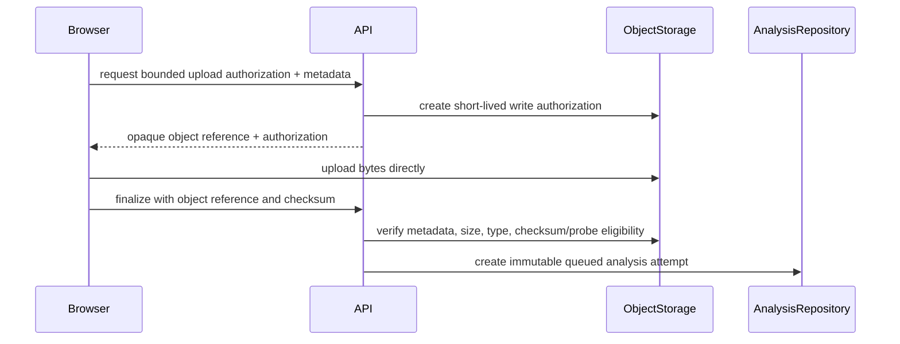

# V2 production containerization and P2 boundaries

## Implemented service boundary

The production-like local topology keeps HTTP handling and analysis execution
in separate processes and images:



The API never performs long-running inference. The frontend is a compiled Vite
bundle served by unprivileged Nginx; it does not run a development server.

## Images

All builds use the repository root as context and the root `.dockerignore`:

```bash
docker build -f docker/frontend.Dockerfile -t footballai-frontend:local .
docker build -f docker/api.Dockerfile -t footballai-api:local .
docker build -f docker/worker.Dockerfile -t footballai-worker:local .
```

- `footballai-frontend` uses locked npm dependencies, a multi-stage build,
  SPA fallback, immutable caching for hashed assets, no-cache runtime config,
  security headers, and an HTTP `/healthz` check.
- `footballai-api` installs the V2 package and pinned API dependencies into a
  Python 3.13 runtime with `ffprobe`. It runs as UID/GID 10001 and exposes
  `/api/health` (liveness) and `/api/ready` (real local run-root, queue-root,
  and video-probe capability checks).
- `footballai-worker` installs the optional pinned `v1_compat` runtime but no
  model. The portable Linux image installs the official CPU-only PyTorch wheel;
  a future GPU deployment should use an explicit accelerator-specific image.
  It runs as UID/GID 10001, consumes the shared queue, and writes only to
  explicit run/queue mounts and temporary storage. Explicit `mps` or `cuda`
  requests still fail if unavailable; no fallback silently changes them to CPU.

The API is deliberately limited to one process while the control plane is the
local manifest adapter. A PostgreSQL-backed deployment may safely revisit that
bound after P2.

## Runtime filesystem contract

The image filesystem is read-only in Compose. Mutable state is explicit:

| Runtime state | Container path | Owner / mount |
| --- | --- | --- |
| Run manifests, uploaded input, artifacts, per-run logs/tmp | `/var/lib/footballai/runs` | shared named volume |
| Local queue state | `/var/lib/footballai/queue` | shared named volume |
| YOLOv8m weights | `/models/yolov8m.pt` | worker-only read-only bind mount |
| Ephemeral process files/caches | `/tmp` | per-container tmpfs |

Videos, generated artifacts, local queue records, credentials, `.env` files,
Git metadata, validation reports, and model weights are excluded from build
contexts and are never copied by a Dockerfile.

## Configuration

`.env.example` lists non-secret settings and placeholders. Local source-based
development retains its existing `data/runs` and `data/job-queue` defaults;
the images default to `/var/lib/footballai/...`.

The backend selectors currently accept only implemented values:

```text
FOOTBALLAI_QUEUE_BACKEND=local
FOOTBALLAI_OBJECT_STORAGE_BACKEND=local
FOOTBALLAI_DATABASE_BACKEND=local_manifest
```

Selecting an Azure or PostgreSQL value fails startup rather than pretending a
dependency is ready. No credentials or Azure account identifiers are part of
application configuration.

The production frontend uses a same-origin `/api` route by default. This keeps
one immutable image portable across environments: the ingress/reverse proxy
routes `/api` to the API service. `FOOTBALLAI_FRONTEND_API_BASE` exists only
for direct localhost development; cross-origin production URLs are rejected by
the runtime script and CSP. `VITE_API_BASE` continues to support the existing
source-based Vite workflow.

For remote API deployments, `FOOTBALLAI_V2_CORS_ORIGINS` accepts explicit HTTPS
origins in `staging` and `production`. Local mode continues to reject anything
except HTTP localhost origins.

## Local production-like startup

```bash
make p1-build
make p1-up
docker compose ps
curl --fail http://localhost:8080/healthz
curl --fail http://localhost:8080/api/health
curl --fail http://localhost:8080/api/ready
make p1-logs
make p1-down
```

Compose intentionally uses the current filesystem queue and local run store.
It does not start PostgreSQL, Azurite, Azure Service Bus emulation, or any Azure
resource. The optional `.models` bind mount supplies weights at runtime; the
deterministic `demo_fast` workflow does not read them.

The validated arm64 images were approximately 26 MB (frontend), 72 MB (API),
and 606 MB (worker). The worker is intentionally larger because it contains the
fully pinned CV/ML runtime; model bytes remain outside the image.

Ultralytics declares the GUI `opencv-python` distribution in its package
metadata. The worker intentionally installs the API-compatible pinned
`opencv-python-headless` distribution instead, so `pip check` reports that one
metadata mismatch even though the `ultralytics`, `cv2`, Torch, PyArrow, and LAP
runtime imports are validated together. This avoids adding duplicate GUI
OpenCV libraries to a headless container.

## Logging and shutdown

API and worker application logs are one-line JSON on stderr with timestamp,
level, service, environment, logger, and a consistently parseable message.
Request logs add request ID, method, route, status, and elapsed time. Worker job
logs add logical analysis ID, run ID, attempt, worker ID, stage/status, bounded
metrics, and safe error code. Credentials and raw private paths are omitted.

Uvicorn handles graceful ASGI shutdown with a bounded timeout. The long-lived
worker handles SIGINT/SIGTERM, finishes the active safe unit, and stops polling;
abandoned filesystem claims are recovered on the next worker start after the
configured claim timeout.

## P2 provider-neutral foundation

### Queue

`JobQueue` is the existing provider-neutral port. `create_job_queue` is now the
configuration composition point, and `LocalFilesystemQueue` remains the only
implemented adapter. The next adapter is `AzureServiceBusQueue`; it must map
enqueue, exclusive claim/lock, completion, failure/dead-letter, cancellation,
and abandoned-lock recovery without leaking Azure SDK types into execution
jobs or domain logic.

### Object storage and direct upload

`ObjectStorage` identifies the input/artifact byte boundary and the current
`LocalAnalysisRunStore` satisfies it locally. The run contract already records
an input URI and checksum without requiring a public local path.

The next P2 refactor should split temporary upload coordination from API-local
paths and implement this sequence behind an application service:



Do not add an Azure SAS endpoint before this authorization/finalization port is
defined and tested. The existing multipart upload remains supported until that
migration is complete.

### PostgreSQL control plane

`AnalysisRepository` identifies lifecycle-record persistence; the current
manifest store satisfies it locally. PostgreSQL should own transactional,
queryable control-plane records:

```text
users, organizations, teams, matches, analyses, analysis_attempts,
stage state, artifact metadata, model versions, evaluation runs, audit events
```

Blob/object storage should own large immutable bytes:

```text
videos, detections, tracklets, game_state, heatmaps, clips, large reports
```

The current local adapter deliberately combines both ports in one run
directory. P2 must compose `PostgreSQLAnalysisRepository` and
`AzureBlobObjectStorage` transactionally, preserving immutable attempts,
checksums, provenance, retry chains, terminal-state rules, and artifact
integrity. No ORM or database dependency is added in P1.

## Explicit next adapters and limitations

P2 requires exactly these new infrastructure adapters and their contract tests:

1. `AzureBlobObjectStorage`, including direct-upload authorization/finalization,
   checksum/metadata verification, and worker materialization or streaming.
2. `AzureServiceBusQueue`, including lock renewal, idempotency, retry/dead-letter
   behavior, cancellation semantics, and safe job serialization.
3. `PostgreSQLAnalysisRepository`, including immutable attempt transactions,
   stage/artifact metadata, optimistic concurrency, and audit events.
4. A composition root that selects those adapters from validated environment
   configuration and uses Managed Identity locally only when an Azure workload
   identity is actually available.

Authentication/RBAC, Terraform, Azure provisioning, GitHub OIDC, full
OpenTelemetry, and Azure resource readiness are not implemented in this phase.
